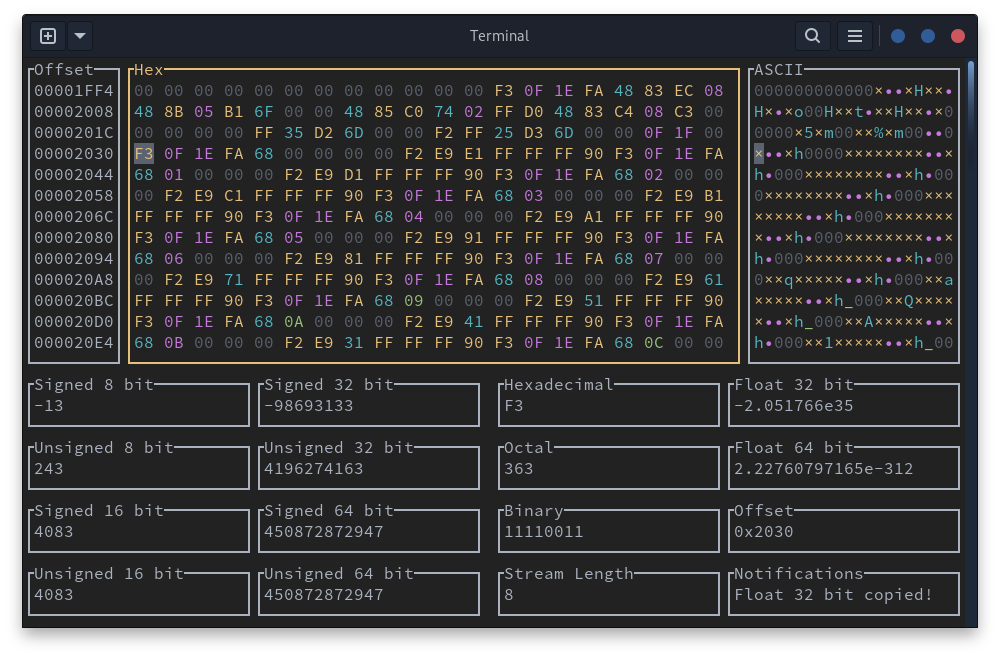

# heh

[](https://crates.io/crates/heh)
[](https://codecov.io/gh/ndd7xv/heh)
[](https://deps.rs/repo/github/ndd7xv/heh)
<!--- [](https://docs.rs/heh/) If https://github.com/rust-lang/docs.rs/issues/238#issuecomment-631333050 is ever closed?-->

The HEx Helper is a cross-platform terminal UI used for modifying file data in hex or ASCII. It aims to replicate some of the look of hexyl while functionally acting like a terminal UI version of GHex.

__heh is currently in alpha - it's not ready to be used in any production manner. Notably, it does not store backups if killed or crashing and there is no undo option after deleting a byte.__



# Installation and Usage

heh is currently only available via cargo:

```
cargo install heh
```

From `heh --help`:
```
...
Terminal UI Commands:
    ALT=                Increase the stream length by 1
    ALT-                Decrease the stream length by 1
    CNTRLs              Save
    CNTRLq              Quit
    CNTRLj              Jump to Byte
    CNTRLe              Change endianness
    CNTRLd              Page Down
    CNTRLu              Page Up
    CNTRLf or /         Search
    CNTRLn or Enter     Next Search Match
    CNTRLp              Prev Search Match

Left-clicking on a label will copy the contents to the clipboard.
Left-clicking on the ASCII or hex table will focus it.

Zooming in and out will change the size of the components.

USAGE:
    heh <FILE>

ARGS:
    <FILE>
            

OPTIONS:
    -h, --help
            Print help information

    -V, --version
            Print version information

```
# Contributing

See [CONTRIBUTING.md](CONTRIBUTING.md).
